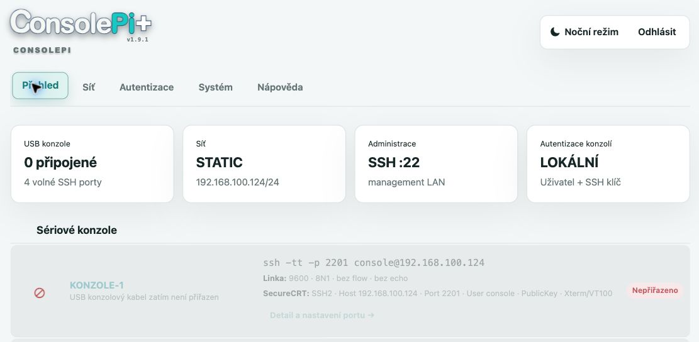

# ConsolePi+ 1.9.1 – instalace na nový Raspberry Pi 3

Aktuální [obrazový přehled rozhraní](docs/WEB-UI.md) a
[bezpečnostní podklady pro audit](docs/security/README.md) obsahují snímky
z testovacího RPi z 6. 10. 2026. Zobrazené adresy jsou příklady.

## Hotový image 1.9.1 v Raspberry Pi Imageru

Stáhněte a otevřete [manifest verze 1.9.1](https://github.com/jiriflos-eng/ConsolePi-Plus/releases/download/v1.9.1/ConsolePi-Plus-1.9.1.rpi-imager-manifest),
nebo jeho URL vložte do **Nastavení → Content Repository → Edit** a potvrďte
**Apply & Restart**. URL sledující nejnovější vydání:

    https://github.com/jiriflos-eng/ConsolePi-Plus/releases/latest/download/ConsolePi-Plus.rpi-imager-manifest

Vyberte Raspberry Pi 3 a ConsolePi+ 1.9.1. Nastavte pouze SSH s jedním veřejným
klíčem Ed25519; ostatní přizpůsobení vypněte. Přímé „Use custom“ pro generic
image nezpřístupňuje požadovanou OS customizaci. Pro statickou IPv4 po ověření
zápisu upravte `consolepi-network.txt` na boot oddílu před prvním startem.
Úplný postup: [instalace image](docs/INSTALACE-IMAGE-RPI-IMAGER.txt).

## Ruční instalace na čistý Raspberry Pi OS Lite

Tento postup používá hotový archiv `ConsolePi-Plus-1.9.1-install.tar.gz`. Nevyžaduje bitovou kopii SD karty a je určen pro čistý Raspberry Pi OS Lite s DHCP.

## 1. Vytvoření SSH klíče

### macOS

V Terminálu na Macu vytvořte osobní klíč správce:

    ssh-keygen -t ed25519 -f "$HOME/.ssh/consolepi-admin" -C "consolepi-admin"

Zadejte volitelnou ochrannou frázi. Vzniknou dva soubory:

- `~/.ssh/consolepi-admin` – soukromý klíč. Zůstává pouze na vašem počítači, nikomu jej neposílejte.
- `~/.ssh/consolepi-admin.pub` – veřejný klíč. Ten se vloží při přípravě Raspberry Pi OS.

Veřejný klíč zobrazíte a zkopírujete příkazem:

    cat "$HOME/.ssh/consolepi-admin.pub"

### Windows 10 nebo 11

Otevřete **PowerShell**, vytvořte nejdříve adresář pro SSH klíče a potom klíč. OpenSSH je součástí běžné instalace moderních Windows:

    New-Item -ItemType Directory -Force "$env:USERPROFILE\.ssh"

    ssh-keygen -t ed25519 -f "$env:USERPROFILE\.ssh\consolepi-admin" -C "consolepi-admin"

Veřejný klíč zobrazíte příkazem:

    Get-Content "$env:USERPROFILE\.ssh\consolepi-admin.pub"

Soukromý klíč je soubor `C:\Users\VAŠE_JMÉNO\.ssh\consolepi-admin`. Veřejný klíč je stejný soubor s příponou `.pub`.

### Linux

V terminálu Linuxu použijte stejný příkaz jako na Macu:

    ssh-keygen -t ed25519 -f "$HOME/.ssh/consolepi-admin" -C "consolepi-admin"

Veřejný klíč zobrazíte příkazem:

    cat "$HOME/.ssh/consolepi-admin.pub"

Ve všech systémech vložte při přípravě SD karty pouze celý obsah souboru `.pub`. Soukromý soubor bez přípony `.pub` si bezpečně ponechte pro SSH připojení a případně jej vyberte v SecureCRT jako Identity File.

## 2. Příprava SD karty

V Raspberry Pi Imager vyberte Raspberry Pi OS Lite (64-bit). V rozšířeném nastavení nastavte:

- uživatele `consolepi`;
- SSH: **povolit autentizaci veřejným klíčem** a vložit obsah souboru `consolepi-admin.pub`;
- síť ponechte jako **DHCP**.

U hotové generic image uživatele ani heslo nenastavujte. V Imageru zapněte
pouze SSH s autentizací veřejným klíčem a vložte jeden klíč Ed25519. Účet
`consolepi` už image obsahuje a jeho systémové heslo je uzamčené.

Zapište kartu, vložte ji do Raspberry Pi a připojte Ethernet. Jako první krok
po připojení můžete IP adresu zjistit nástrojem **ConsolePi Plus Discovery**. Jeho
zdroj je v [tools/consolepi-discover](tools/consolepi-discover); binárky pro
macOS, Windows a Linux vytvoří příkaz uvedený dále v kapitole *Nalezení
ConsolePi Plus v lokální síti*.
Generic first-boot průvodce vyžaduje alespoň jednu IPv4 management síť;
více sítí lze oddělit čárkou nebo mezerou.
Do dokončení jsou z IPv4 sítí dočasně otevřené pouze porty 22, 80 a 443; poté se
přístup okamžitě omezí na zadaný allowlist. Podrobný postup je v
`docs/INSTALACE-IMAGE-RPI-IMAGER.txt`.

## 3. Povinná aktualizace Raspberry Pi OS

Nejdříve se přihlaste na nové Raspberry Pi a aktualizujte systém. Instalátor ConsolePi+ vyžaduje aktuální Raspberry Pi OS a balíčky.

    ssh -i "$HOME/.ssh/consolepi-admin" consolepi@IP_RPI
    sudo apt update
    sudo apt full-upgrade -y
    sudo reboot

Po restartu se znovu přihlaste stejným příkazem.

## 4. Přenos instalačního archivu

Z Macu odešlete hotový archiv přímo do domovského adresáře uživatele `consolepi`. Místo `IP_RPI` doplňte DHCP adresu zařízení:

    scp -i "$HOME/.ssh/consolepi-admin" "ConsolePi-Plus-1.9.1-install.tar.gz" consolepi@IP_RPI:~/

Pokud soubor nemáte v aktuálním adresáři, použijte jeho úplnou cestu, například:

    scp -i "$HOME/.ssh/consolepi-admin" "$HOME/Downloads/ConsolePi-Plus-1.9.1-install.tar.gz" consolepi@IP_RPI:~/

Ve Windows použijte v PowerShellu odpovídající cestu k soukromému klíči:

    scp -i "$env:USERPROFILE\.ssh\consolepi-admin" "$HOME\Downloads\ConsolePi-Plus-1.9.1-install.tar.gz" consolepi@IP_RPI:~/

## 5. Instalace na Raspberry Pi

Přihlaste se na Raspberry Pi:

    ssh -i "$HOME/.ssh/consolepi-admin" consolepi@IP_RPI

Na Raspberry Pi spusťte následující příkazy. Archiv se rozbalí do vašeho domovského adresáře; instalační skript pak spustíte bez `sudo`.

    install_dir="$HOME/consolepi-install"
    mkdir -p "$install_dir"
    tar --no-same-owner -xzf "$HOME/ConsolePi-Plus-1.9.1-install.tar.gz" -C "$install_dir"
    cd "$install_dir"
    ./bootstrap-install.sh

Instalátor funguje jak při přihlášení SSH klíčem, tak při přihlášení heslem. Pokud nenajde veřejný klíč aktuálního správce, vytvoří pouze dočasný instalační klíč bez zachované soukromé části. V průvodci prvního spuštění proto vždy vložte vlastní veřejný klíč nebo nechte vytvořit a jednou stáhnout nový osobní klíč. Instalátor nastaví firewall pro právě získanou ethernetovou DHCP síť a připraví webový průvodce. Nová instalace začne porty `KONZOLE-1` až `KONZOLE-4` ve stavu nepřiřazeno.

## APT repozitáře po instalaci

ConsolePi+ ve výchozím stavu používá oficiální repozitáře Debianu a Raspberry
Pi. Pro síť bez přímého přístupu k internetu otevřete **Síť → APT repozitáře**
a přepněte na lokální mirror. Zadejte samostatné HTTP/HTTPS adresy pro Debian,
Debian Security a Raspberry Pi; ConsolePi+ všechny tři zdroje ověří odděleným
`apt-get update` ještě před nahrazením aktivní konfigurace. Proxy je nezávislá
volba a lze ji kombinovat s oběma režimy. První bootstrap stále potřebuje
dostupné zdroje balíčků nebo odpovídající proxy.

## 6. První spuštění

Po dokončení otevřete v prohlížeči:

    https://IP_RPI/

U nového zařízení je normální varování prohlížeče o vlastním HTTPS certifikátu. Dokončete průvodce: nastavte heslo webové administrace, název zařízení, hostname a případně rozšíření oddílu SD karty. V kroku **Administrativní SSH přístup** buď vložte existující veřejný klíč `.pub`, nebo nechte vytvořit nový osobní klíč. V druhém případě se privátní soubor stáhne jen jednou; bezpečně jej uložte a použijte v SecureCRT jako Identity File.

Dokončení průvodce vytvoří nové SSH hostitelské klíče. Nezávisle ověřte nový fingerprint. Pokud se na stejné IP adrese dříve nacházelo jiné ConsolePi+, teprve potom odstraňte starý záznam:

    ssh-keygen -R IP_RPI

Potom se znovu připojte a ověřte nový fingerprint zobrazený klientem SSH.

## 7. Rychlá kontrola

Administrativní SSH je dostupné na portu 22:

    ssh -i "$HOME/.ssh/consolepi-admin" consolepi@IP_RPI

Konzolové porty jsou po připojení USB kabelů dostupné na portech 2201 až 2204. Jejich přiřazení, popis a sériové parametry nastavíte ve webové administraci.

Pro základní diagnostiku na Raspberry Pi použijte:

    sudo consolepi-diagnose

## Nalezení ConsolePi Plus v lokální síti

ConsolePi+ oznamuje v aktuálním ethernetovém segmentu službu mDNS/Bonjour
`_consolepi._tcp.local`. Nástroj `consolepi-discover` pro macOS, Windows a
Linux pak bez skenování sítě vypíše IPv4 adresu, HTTPS URL a SSH příkaz.
Služba je pouze link-local: přes router nebo mezi VLAN neprochází. Pro hledání
ve vzdálené síti proto použijte známou IP adresu nebo síťový mDNS reflector.
Nalezení přes mDNS není ověření identity: před zadáním přihlašovacích údajů
vždy ověřte HTTPS certifikát nebo SSH host-key fingerprint.

Samostatně vydaný Discovery klient je ke stažení v
[releasu ConsolePi+ v1.9.0](https://github.com/jiriflos-eng/ConsolePi-Plus/releases/tag/v1.9.0):
pro macOS (Apple Silicon i Intel), Windows x64 a Linux (x64 i ARM64).
Soubor `consolepi-discover-v1.9.0.sha256` slouží k ověření stažených binárek.
ZIP pro macOS i Windows obsahuje složku `ConsolePi Plus Discovery` a spouštěč
přibalené aplikace. Po ověření checksumu v macOS spusťte
`Spustit ConsolePi Plus Discovery.command`; ve Windows použijte
`Spustit ConsolePi Plus Discovery.cmd` a případně postupujte podle SmartScreen.

Samostatné binárky pro macOS, Windows a Linux vytvoří Go 1.22+ příkazem:

    ./tools/build-consolepi-discover.sh

Při vývoji lze z adresáře `tools/consolepi-discover` použít `go run . --timeout 5s`.
Binárka standardně otevře jednoduché grafické rozhraní pouze na `127.0.0.1`,
kde lze seznam obnovit, otevřít web zařízení nebo zkopírovat SSH příkaz.
Parametr `--shell` vypíše nálezy do terminálu; úplnou nápovědu zobrazí
`--help`.

## Monitoring v Zabbixu

ConsolePi+ poskytuje metriky pouze pro čtení přes SNMPv3 `authPriv`. Připravená
[šablona pro Zabbix 7.4](zabbix/template_consolepi_snmpv3_7.4.yaml) sleduje
CPU, teplotu, paměť, kořenový oddíl, uptime, dostupné aktualizace a požadavek
na restart, ethernetový link, požadované služby ConsolePi+ a stavy čtyř
sériových konzolí. Postup importu je v [návodu pro Zabbix](zabbix/README.md).
Před aktivací SNMPv3 přidejte server nebo proxy Zabbixu do **Síť → Povolené
zdroje přístupu**; UDP/161 není povolen mimo tento allowlist.

### Statická adresa z boot oddílu generic image

Vydaný generic image 1.9.1 obsahuje na FAT boot oddílu soubor
`consolepi-network.txt`. Po zápisu SD karty jej lze upravit na počítači
a nastavit `MODE=static`, `ADDRESS=192.168.1.50/24`, `GATEWAY=192.168.1.1`
a `DNS=192.168.1.1,1.1.1.1` podle vlastní sítě. DHCP pak pro první start
není potřeba. Podrobný postup i řešení chyb jsou v
[návodu pro image](docs/INSTALACE-IMAGE-RPI-IMAGER.txt).
Starší image 1.9.0 generic-v16 tuto funkci neobsahuje; použijte image 1.9.1.

## Logování a bezpečnostní posouzení

Výchozí režim **Pouze události** neukládá obsah terminálu. Zdrojový kód 1.9.1
zaznamenává v režimech **output** i **full** výstup přes `picocom --logfile`.
Vstup operátora nezapisuje samostatně, zařízení jej ale může vracet ve výstupu.
Aktivní cesta relace nevolá redakční writer; na popisky „aktivní redakce“ nebo
„obousměrný přepis“ proto nespoléhejte jako na záruku. Pokud se nesmí ukládat
obsah terminálu, ponechte Pouze události. Podrobnosti a dosud nevyhodnocené
testy jsou v [bezpečnostních podkladech](docs/security/README.md).

## Vzdálený syslog

Zdroje 1.9.1 obsahují **Systém → Logování → Vzdálený syslog**: práh severity 0–7
jako u síťových prvků, TCP/TLS s ověřením certifikátu, omezenou trvalou frontu
a testovací zprávu. Výchozí stav je vypnuto; sériové přepisy se neodesílají.
[Nastavení, omezení doručení a stav distribuce](docs/SYSLOG.md).
