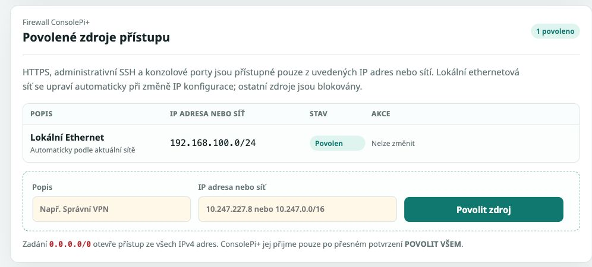
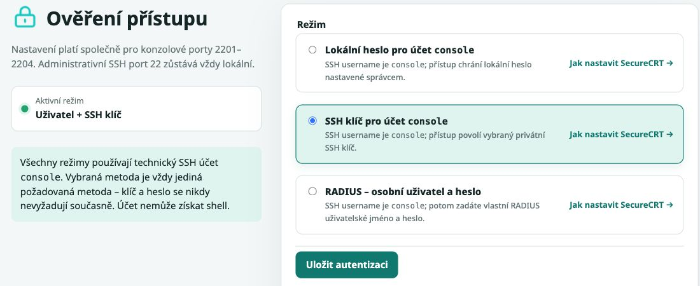
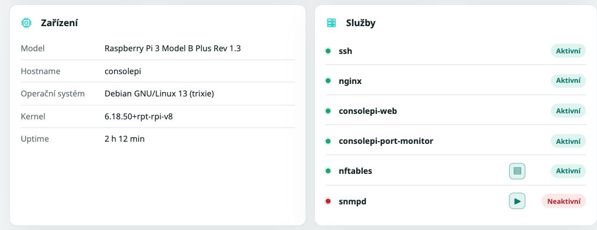
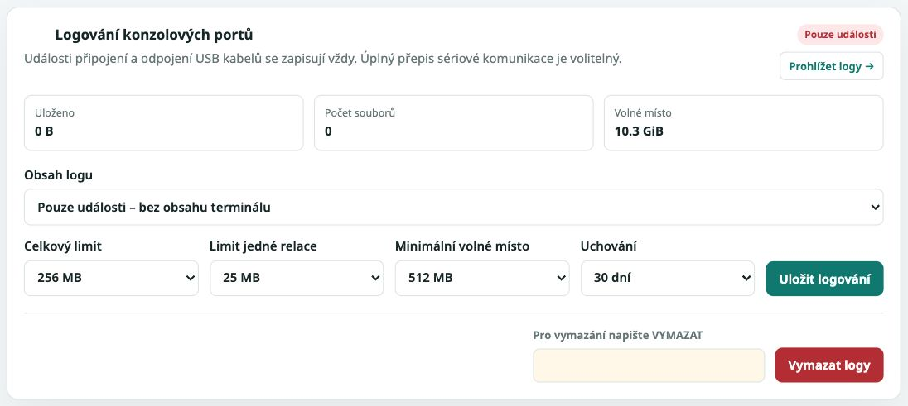
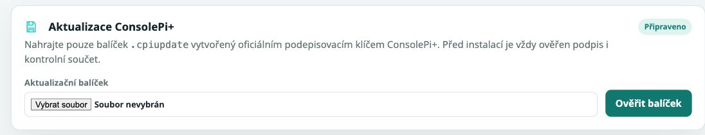
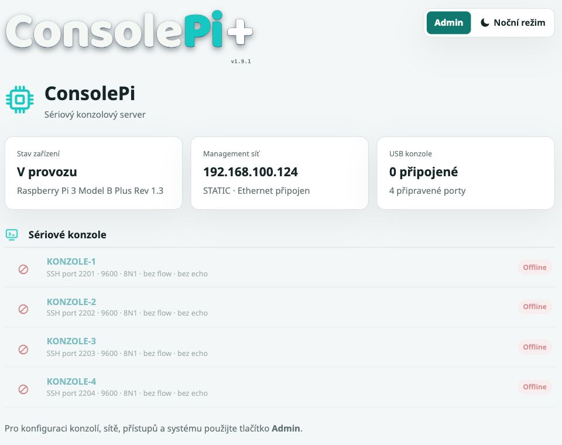

# ConsolePi+ 1.9.1 – obrazový přehled rozhraní

Skutečné výřezy pořízené 6. 10. 2026 na testovacím Raspberry Pi 3 B+.
Zobrazené adresy a stavy jsou příklady. Na zařízení nebyl připojen USB adaptér;
šedé konzolové karty proto ukazují nepřiřazený nebo offline port. Screenshoty
slouží k orientaci; bezpečnostní účinnost nastavení vyžaduje samostatný test.

## Přehled administrace / Administration overview

Odděluje administrativní SSH na portu 22 od sériových portů 2201–2204.
Shows administrative SSH separately from serial-console ports.

## Síťový allowlist / Network allowlist

Panel ukazuje povolenou management síť pro HTTPS, SSH a konzole. Zobrazení
položky samo neprokazuje vynucení pravidel nftables.
Lists allowed management sources; firewall enforcement needs independent testing.

## Autentizace konzolí / Console authentication

Vybraná metoda platí pro účet console na sériových portech; administrativní
SSH a webové heslo mají oddělené nastavení.
The selected method applies to serial consoles, separately from administration.

## Platforma a služby / Platform and services

Testovací RPi uvádí Debian 13 a SNMP vypnuté. Dostupnost služby není kontrolou
jejích oprávnění nebo naslouchajících adres.
Service status does not prove privilege or listening-address restrictions.

## Logování / Logging

Na snímku je aktivní Pouze události. Popisky redakce a obousměrného režimu
v původním webu neodpovídají aktivní cestě záznamu 1.9.1; viz
[upřesnění podle zdrojového kódu](security/README.md#upřesnění-logování-podle-zdrojů-191).
Events-only mode is active; see the security documentation for implementation limits.

## Ověření aplikační aktualizace / Application update verification

Formulář přijímá podepsaný balíček .cpiupdate. Nenahrazuje systémové aktualizace
APT a jeho obrázek neprokazuje odmítnutí neplatného podpisu.
Signed application packages are separate from APT operating-system updates.

## Stavová stránka / Status page

Ukazuje model, IP a konzolové porty. Přístupnost z jednotlivých síťových segmentů
posuďte v akceptačních testech.
Shows device and console state; assess access from each relevant network segment.

Úplné výřezy S01–S16 a jejich vazby na testy jsou v
[bezpečnostních dokumentech a sešitu](security/README.md).
